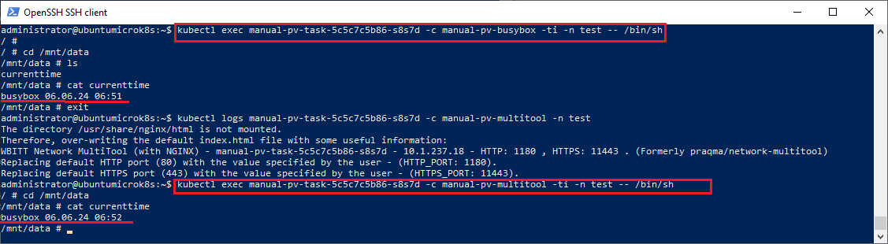
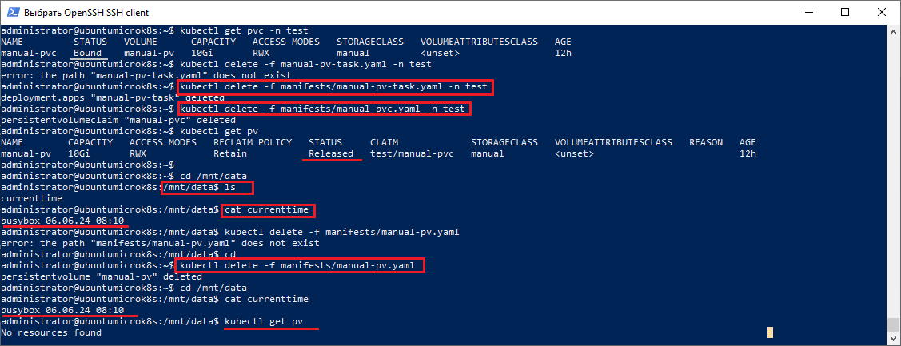
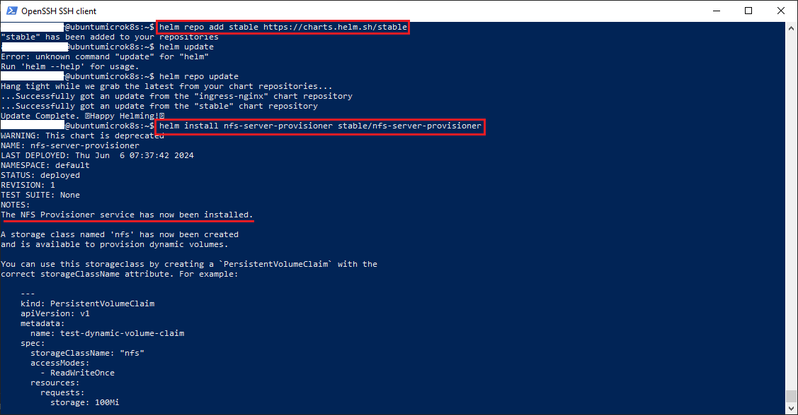
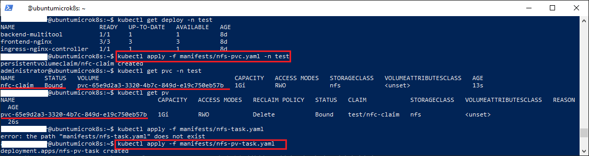
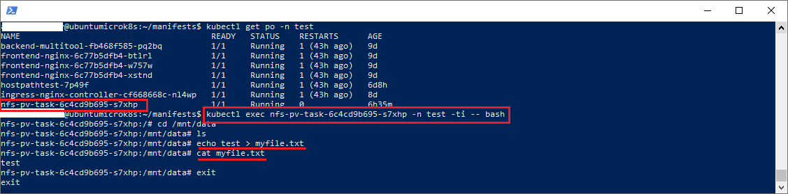
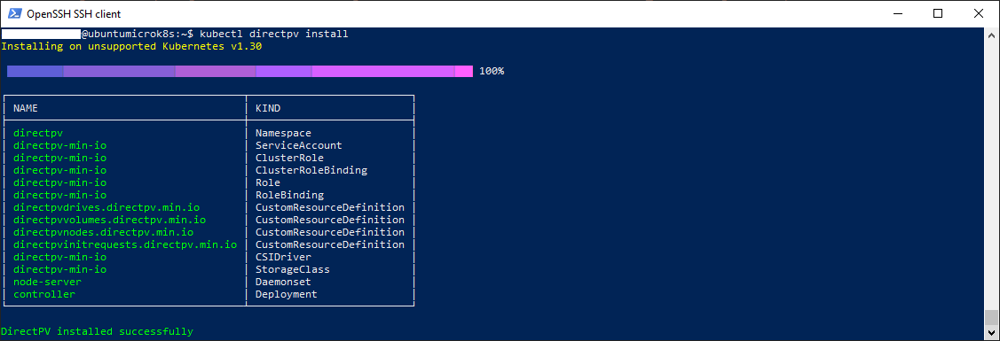
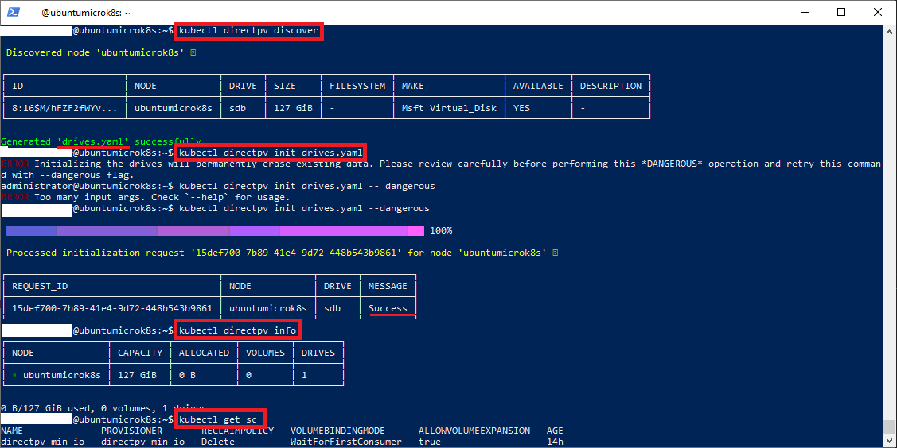

### Задание 1

**Что нужно сделать**

Создать Deployment приложения, использующего локальный PV, созданный вручную.

1. Создать Deployment приложения, состоящего из контейнеров busybox и multitool.
2. Создать PV и PVC для подключения папки на локальной ноде, которая будет использована в поде.
3. Продемонстрировать, что multitool может читать файл, в который busybox пишет каждые пять секунд в общей директории. 
4. Удалить Deployment и PVC. Продемонстрировать, что после этого произошло с PV. Пояснить, почему.
5. Продемонстрировать, что файл сохранился на локальном диске ноды. Удалить PV.  Продемонстрировать что произошло с файлом после удаления PV. Пояснить, почему.
5. Предоставить манифесты, а также скриншоты или вывод необходимых команд.

### Решение 1
 
1. Решение включает в себя 3 файлп манифестов, которые устанавливаются командой ```kubectl apply -f <name.yaml>```
  - Манифест pv находится в [файле](manifests/manual-pv.yaml)
  - Манифест pvc, который привязывается к данному pv, находится в [файле](manifests/manual-pvc.yaml)
  - Манифест приложения, состоящего из двух контейнеров с образами busybox и multitool, находится в [файле](manifests/manual-pv-task.yaml)
2. Контейнер busybox пишет каждые 5 секунд текущую дату и время в файл currenttime, расположенный в общей папке */mnt/data*. Для демонстрации того что контейнер с образом multitool читает этот файл, необходимо подключится к контейнеру и выполнить команду ```cat /mnt/data/currenttime```
Команда подключения к контейнеру выглядит примерно так: ```kubectl exec manual-pv-task-5c5c7c5b86-s8s7d -c manual-pv-multitool -ti -n test -- /bin/sh``` <br/> 
В итоге получаем результат:


3. После удаления приложения и pvc и потом pv файл с данными остался. Данные в файле остались на момент удаления приложения.
Ниже представлен сам процесс удаления и результаты команды *cat*:


------

### Задание 2

**Что нужно сделать**

Создать Deployment приложения, которое может хранить файлы на NFS с динамическим созданием PV.

1. Включить и настроить NFS-сервер на MicroK8S.
2. Создать Deployment приложения состоящего из multitool, и подключить к нему PV, созданный автоматически на сервере NFS.
3. Продемонстрировать возможность чтения и записи файла изнутри пода. 
4. Предоставить манифесты, а также скриншоты или вывод необходимых команд.

### Решение 2

1. Установка NFS-сервера
   - Добавляем репозиторий чартов *stable* в helm:
   ```helm repo add stable https://charts.helm.sh/stable```
   - Устанавливаем релиз nfs провайдера из хранилища [stable](https://charts.helm.sh/stable):
   ```helm install nfs-server-provisioner stable/nfs-server-provisioner```

   В результате получаем:
   

2. Перед выделением хранилища необходимо удостовериться что установлен пакет *nfs-common*. Можно выполнить команду:
```sudo apt update && sudo apt install nfs-common -y```
3. Устанавливаем следующие манифесты:
  - Манифест запроса на хранилище(pvc) расположен в [файле](manifests/nfs-pvc.yaml)
  - Манифест приложения использующего хранилище расположен в [файле](manifests/nfs-pv-task.yaml)
  Процесс развертывания манифестов выглядит так:
  

4. Проверяем чтение и запись в хранилище внутри пода:


Дополнительно был проверен провайдер directpv, т.к. он является более эффективным средством доступа к хранилищам, а также хорошо интегрирован с minio.

### Дополнительно: Инсталляция провайдера данных(CSI) directPV 

1. Установка пакетного менеджера krew:
 - Скачиваем дистирбутив и распаковываем в текущей папке:
 ```sudo wget -c "https://github.com/kubernetes-sigs/krew/releases/latest/download/krew-linux_amd64.tar.gz" -O - |  tar -xz```
 - Запускаем инсталяцию krew:
 ``` ./krew-linux_amd64 install krew```
 В результате устанавливается плагин k8s, который позволяет устанавливать дополнительные пакеты
 - Устанавливаем рабочую директорию плагина в *.bashrc*(по умолчанию krew инсталируется в папку *.krew* домашней директории пользователя):
 ```echo export PATH="${KREW_ROOT:-$HOME/.krew}/bin:$PATH">~/.bashrc```
 - Вызываем обновление локального индекса krew:
 ```kubectl krew update```

2. Через плагин krew устанавливаем провайдер прямого доступа к хранилищам *directPV*(Это самый простой и надежный способ установки. Он устанавливает directpv по умолчанию. Можно также произвести установку вручную, вызвав команду ```kubectl krew install directpv -o yaml>directpv-install.yaml```. Это создаст файл установки *directpv-install.yaml*. Чтобы применить сделанные настройки достаточно затем выполнить команду: ```kubectl apply -f directpv-install.yaml``` )
  - Устанавливаем плагин directPV для k8s в локальную папку krew(*.krew*):
  ```kubectl krew install directpv```
  Появляется возможность вводить команду ```kubectl directpv...```
  - Устанавливаем сам провайдер:
  ``` kubectl directpv install``` 
  Инсталляция занимает 5 секунд и выглядит примерно так:
  
  - Объекты directpv устанавливаются в namespace *directpv*. Проверяем что все поды установлены и запущены:
  ```kubectl get po -n directpv```

  
 Самая инсталляцция занимает несколько секунд. Выглядит примерно так(на примере microk8s):
 

3. Подключение хранилищ(драйверов устройств хранения)
После установки провайдера directpv нет ни одного хранилища. Провайдер directpv проводит подключение хранилищ путем их обнаружения.
  - Подключаем к нодам кластера необходимые дополнительные виртуальные диски(используем обычный гипервизор для добавления виртуального диска)
  - Выполняем обнаружение хранилищ в кластере(можно использовать ключ *--nodes=<регулярное выражение имени нод>* для опроса только выбранных нод в кластере)
  ```kubectl directpv discover```
    В результате генерируется файл *drives.yaml* со списком подключаемых дисков
  - Проводим подключение дисков(при этом проводится их форматирование, пожтому требуется ключ --dangerous) к кластеру:
  ```kubectl directpv init drives.yaml --dangerous``` 
  - Проверяем что диски подключились:
  ```kubectl directpv info```

  Вот как выглядит сам процесс обнаружения и подключения драйверов устройств хранения:
  


